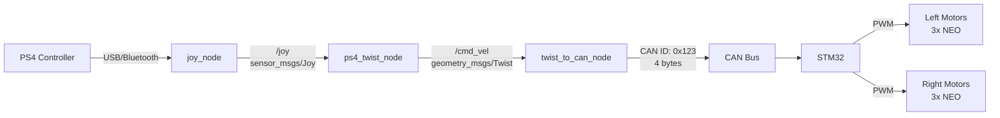
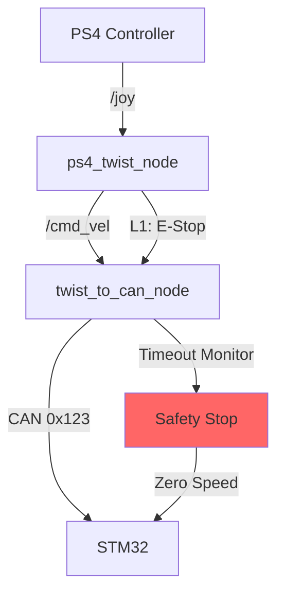

# Differential Drive CAN Control System Design

## Overview
This document describes the design and implementation of the `diff_drive_can` ROS 2 package for controlling a differential drive rover using a PS4 controller over CAN bus communication.

## System Architecture

### High-Level Pipeline
1. PS4 controller joystick input → ROS 2 `sensor_msgs/Joy`
2. Translate joystick input to `geometry_msgs/Twist` → `/cmd_vel`
3. Convert `Twist` to two motor speeds (left/right) using differential drive formula
4. Send speeds over CAN to an STM32 (4 bytes: int16_t left, int16_t right)
5. STM32 converts these into two PWM signals for left/right motor groups (3 NEO motors per side via SPARK MAX)

### Architecture Diagram


### Safety Architecture


## Package Structure
```
src/diff_drive_can/
├── diff_drive_can/
│   ├── __init__.py
│   ├── ps4_twist_node.py
│   └── twist_to_can_node.py
├── launch/
│   └── diff_drive_can.launch.py
├── config/
│   └── diff_drive_params.yaml
├── package.xml
├── setup.py
├── setup.cfg
├── README.md
└── DESIGN.md
```

## Robot Specifications

### Physical Parameters
- **Wheel Base**: 4 feet (1.22 meters)
- **Motor Configuration**: 6 NEO motors (3 per side)
- **Motor Controllers**: SPARK MAX (controlled by STM32)

### Performance Specifications
- **Max Linear Speed**: 2.0 m/s
- **Max Angular Speed**: 1.64 rad/s (allows for ~0.75m turning radius)
- **Minimum Turning Radius**: 0.61m (wheel_base/2, when spinning in place)

## Node Specifications

### Node 1: ps4_twist_node.py

**Purpose**: Convert PS4 joystick input to Twist messages

**Subscriptions**:
- `/joy` (sensor_msgs/Joy) - Raw joystick data

**Publications**:
- `/cmd_vel` (geometry_msgs/Twist) - Velocity commands

**Key Features**:
- Map left stick Y-axis to linear velocity (`Twist.linear.x`)
- Map left stick X-axis to angular velocity (`Twist.angular.z`)
- Implement deadzone filtering (±0.1)
- Support turbo mode with R1 button
- Emergency stop with L1 button
- Publish at 50Hz

**Parameters**:
- `linear_axis`: Joystick axis for linear motion (default: 1)
- `angular_axis`: Joystick axis for angular motion (default: 0)
- `max_linear_speed`: Maximum linear velocity in m/s (default: 2.0)
- `max_angular_speed`: Maximum angular velocity in rad/s (default: 1.64)
- `deadzone`: Joystick deadzone threshold (default: 0.1)
- `turbo_button`: Button index for turbo mode (default: 5 - R1)
- `turbo_multiplier`: Speed multiplier when turbo is active (default: 1.5)
- `emergency_stop_button`: Button index for emergency stop (default: 4 - L1)
- `publish_rate`: Publishing frequency in Hz (default: 50.0)

### Node 2: twist_to_can_node.py

**Purpose**: Convert Twist commands to CAN motor commands

**Subscriptions**:
- `/cmd_vel` (geometry_msgs/Twist) - Velocity commands

**CAN Output**:
- CAN ID: 0x123
- Data: 4 bytes (left_speed: int16_t, right_speed: int16_t)

**Key Features**:
- Implement differential drive kinematics
- Scale speeds to PWM range (0-1999)
- Pack as int16_t in big-endian format
- Send via socketcan on `can0` interface
- Command timeout safety (0.5s)
- Acceleration ramping
- CAN error handling and recovery

**Parameters**:
- `wheel_base`: Distance between wheels in meters (default: 1.22)
- `max_linear_speed`: Maximum linear speed in m/s (default: 2.0)
- `max_angular_speed`: Maximum angular speed in rad/s (default: 1.64)
- `pwm_min`: Minimum PWM value (default: 0)
- `pwm_max`: Maximum PWM value (default: 1999)
- `pwm_neutral`: Neutral/stop PWM value (default: 1000)
- `can_interface`: CAN interface name (default: "can0")
- `can_id`: CAN message ID (default: 0x123)
- `can_bitrate`: CAN bus bitrate (default: 500000)
- `cmd_vel_timeout`: Timeout for cmd_vel messages in seconds (default: 0.5)
- `ramp_rate`: Acceleration ramp rate in PWM units per ms (default: 5.0)

## Differential Drive Kinematics

The conversion from Twist to wheel speeds uses standard differential drive equations:

```python
# Convert Twist to wheel velocities
left_velocity = linear_vel - (angular_vel * wheel_base / 2)
right_velocity = linear_vel + (angular_vel * wheel_base / 2)

# Scale to PWM range (0-1999, with 1000 as neutral)
left_pwm = int(1000 + (left_velocity / max_linear_speed) * 999)
right_pwm = int(1000 + (right_velocity / max_linear_speed) * 999)
```

## CAN Communication Protocol

### Message Format
```
Standard CAN Frame (11-bit ID: 0x123)
Data Length: 4 bytes

Byte 0-1: Left motor speed (int16_t, big-endian)
          Range: 0-1999 (0 = full reverse, 1000 = stop, 1999 = full forward)
Byte 2-3: Right motor speed (int16_t, big-endian)
          Range: 0-1999 (0 = full reverse, 1000 = stop, 1999 = full forward)
```

### CAN Bus Configuration

#### Hardware Setup
1. **Jetson CAN Pins**:
   - CAN0_TX: Pin 29 (GPIO01)
   - CAN0_RX: Pin 31 (GPIO11)
   - GND: Pin 30

2. **CAN Transceiver**:
   - Use MCP2551 or SN65HVD230
   - Connect Jetson CAN pins to transceiver
   - Ensure 120Ω termination resistors on both ends

#### Software Setup
1. **Enable CAN kernel modules**:
   ```bash
   sudo modprobe can
   sudo modprobe can_raw
   sudo modprobe mttcan
   ```

2. **Configure CAN interface**:
   ```bash
   # Set up can0 interface with 500kbps bitrate
   sudo ip link set can0 type can bitrate 500000
   sudo ip link set can0 up
   
   # Verify interface is up
   ip -details link show can0
   ```

3. **Make configuration persistent**:
   Create `/etc/systemd/network/80-can.network`:
   ```ini
   [Match]
   Name=can0
   
   [CAN]
   BitRate=500000
   RestartSec=100ms
   ```

## Safety Features

### 1. Emergency Stop
- L1 button immediately sends zero velocities to all motors
- Visual/audio feedback when activated
- Requires button release and re-press to resume operation

### 2. Command Timeout
- Motors stop if no `/cmd_vel` received for 0.5 seconds
- Prevents runaway robot if communication is lost
- Configurable timeout duration

### 3. Acceleration Ramping
- Gradual speed changes to prevent wheel slip
- Configurable ramp rate (PWM units per millisecond)
- Separate ramp rates for acceleration and deceleration

### 4. CAN Bus Monitoring
- Detect bus-off conditions
- Monitor error counters
- Automatic recovery attempts
- Diagnostic message publishing

## Configuration File

### config/diff_drive_params.yaml
```yaml
# PS4 Controller Configuration
ps4_twist_node:
  ros__parameters:
    # Joystick axes
    linear_axis: 1      # Left stick Y-axis
    angular_axis: 0     # Left stick X-axis
    
    # Speed limits
    max_linear_speed: 2.0    # m/s
    max_angular_speed: 1.64  # rad/s
    
    # Control parameters
    deadzone: 0.1
    turbo_button: 5          # R1 button
    turbo_multiplier: 1.5
    emergency_stop_button: 4 # L1 button
    
    # Publishing rate
    publish_rate: 50.0       # Hz

# CAN Motor Control Configuration
twist_to_can_node:
  ros__parameters:
    # Robot dimensions
    wheel_base: 1.22         # meters (4 feet)
    
    # Speed limits (should match ps4_twist_node)
    max_linear_speed: 2.0    # m/s
    max_angular_speed: 1.64  # rad/s
    
    # PWM configuration
    pwm_min: 0
    pwm_max: 1999
    pwm_neutral: 1000        # Neutral/stop position
    
    # CAN configuration
    can_interface: "can0"
    can_id: 0x123
    can_bitrate: 500000      # 500 kbps
    
    # Safety parameters
    cmd_vel_timeout: 0.5     # seconds
    ramp_rate: 5.0           # PWM units per ms
    
    # Debug
    debug_mode: false
```

## Launch File

The launch file starts both nodes with their respective parameters:

```python
from launch import LaunchDescription
from launch_ros.actions import Node
from launch.substitutions import PathJoinSubstitution
from launch_ros.substitutions import FindPackageShare

def generate_launch_description():
    # Get package share directory
    pkg_share = FindPackageShare('diff_drive_can')
    
    # Path to config file
    config_file = PathJoinSubstitution([
        pkg_share,
        'config',
        'diff_drive_params.yaml'
    ])
    
    # PS4 to Twist node
    ps4_twist_node = Node(
        package='diff_drive_can',
        executable='ps4_twist_node',
        name='ps4_twist_node',
        parameters=[config_file],
        output='screen'
    )
    
    # Twist to CAN node
    twist_to_can_node = Node(
        package='diff_drive_can',
        executable='twist_to_can_node',
        name='twist_to_can_node',
        parameters=[config_file],
        output='screen'
    )
    
    # Joy node (from joy package)
    joy_node = Node(
        package='joy',
        executable='joy_node',
        name='joy_node',
        parameters=[{
            'dev': '/dev/input/js0',
            'deadzone': 0.1,
            'autorepeat_rate': 20.0,
        }]
    )
    
    return LaunchDescription([
        joy_node,
        ps4_twist_node,
        twist_to_can_node
    ])
```

## Testing Strategy

### 1. Unit Testing
- Test differential drive calculations
- Test PWM scaling and clamping
- Test CAN message packing
- Test safety features (timeout, emergency stop)

### 2. Integration Testing
```bash
# Test PS4 input
ros2 topic echo /joy

# Test Twist output
ros2 topic echo /cmd_vel

# Monitor CAN messages
candump can0

# Send test CAN message
cansend can0 123#0003E70003E7
```

### 3. System Testing
- Test full pipeline from controller to motors
- Verify emergency stop functionality
- Test timeout behavior
- Measure latency from input to CAN output

### 4. Test Commands
```bash
# Build the package
cd ~/Desktop/mars_rover_ws
colcon build --packages-select diff_drive_can

# Source the workspace
source install/setup.bash

# Launch the system
ros2 launch diff_drive_can diff_drive_can.launch.py

# In separate terminals:
# Monitor joystick
ros2 topic echo /joy

# Monitor velocity commands
ros2 topic echo /cmd_vel

# Monitor CAN bus
candump -ta can0
```

## Error Handling

### CAN Bus Errors
- Bus-off recovery
- Error counter monitoring
- Automatic interface reset
- Fallback to safe state

### Communication Errors
- Timeout detection
- Message validation
- Rate limiting
- Error logging

### Controller Errors
- Disconnection detection
- Invalid input handling
- Calibration drift compensation

## Performance Considerations

### Latency
- Target: < 20ms from joystick input to CAN output
- Joy node: ~5ms
- ps4_twist_node: ~2ms
- twist_to_can_node: ~3ms
- CAN transmission: ~1ms

### CPU Usage
- Expected: < 5% total on Jetson
- Optimization: Use efficient data structures
- Avoid unnecessary copies

### Memory Usage
- Minimal memory footprint
- No memory leaks
- Proper resource cleanup

## Future Enhancements

1. **Feedback Integration**
   - Read encoder data from STM32
   - Implement closed-loop control
   - Odometry publishing

2. **Advanced Safety**
   - Obstacle detection integration
   - Speed limiting based on conditions
   - Geofencing support

3. **Telemetry**
   - Motor current monitoring
   - Temperature monitoring
   - Battery voltage tracking

4. **Configuration**
   - Dynamic reconfigure support
   - Web-based configuration interface
   - Parameter persistence

## Dependencies

### ROS 2 Packages
- `rclpy`: Python client library
- `sensor_msgs`: For Joy messages
- `geometry_msgs`: For Twist messages
- `joy`: Joystick driver

### Python Packages
- `python-can`: CAN bus interface
- `struct`: Binary data packing
- `threading`: For timeout monitoring

### System Requirements
- ROS 2 Humble
- Python 3.8+
- Linux with SocketCAN support
- CAN interface hardware

## References

1. [ROS 2 Documentation](https://docs.ros.org/en/humble/)
2. [python-can Documentation](https://python-can.readthedocs.io/)
3. [Differential Drive Kinematics](http://www.cs.columbia.edu/~allen/F17/NOTES/icckinematics.pdf)
4. [SocketCAN Documentation](https://www.kernel.org/doc/Documentation/networking/can.txt)